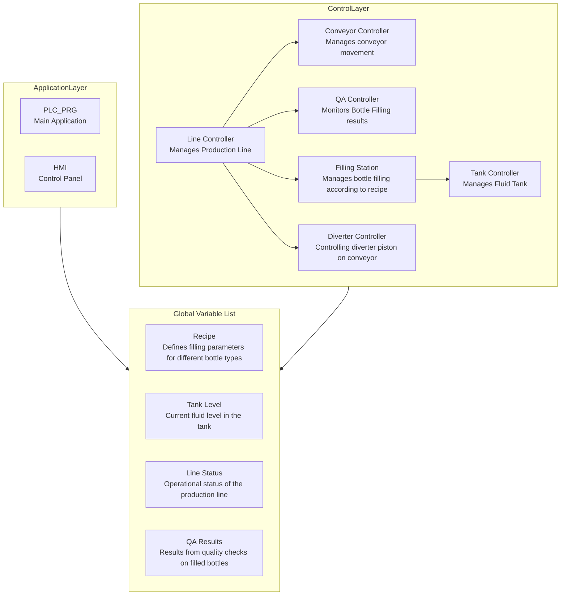
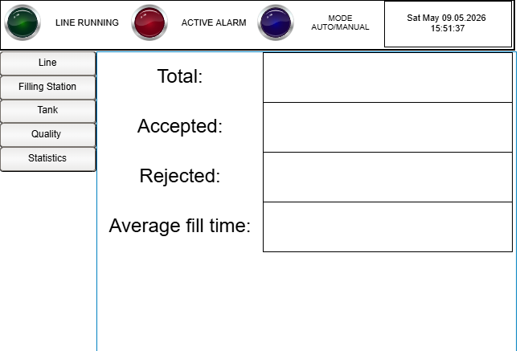
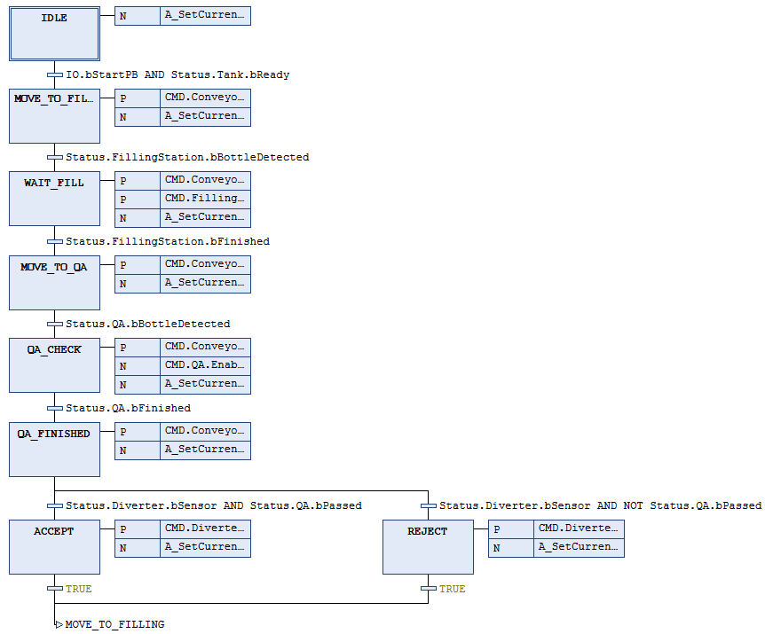
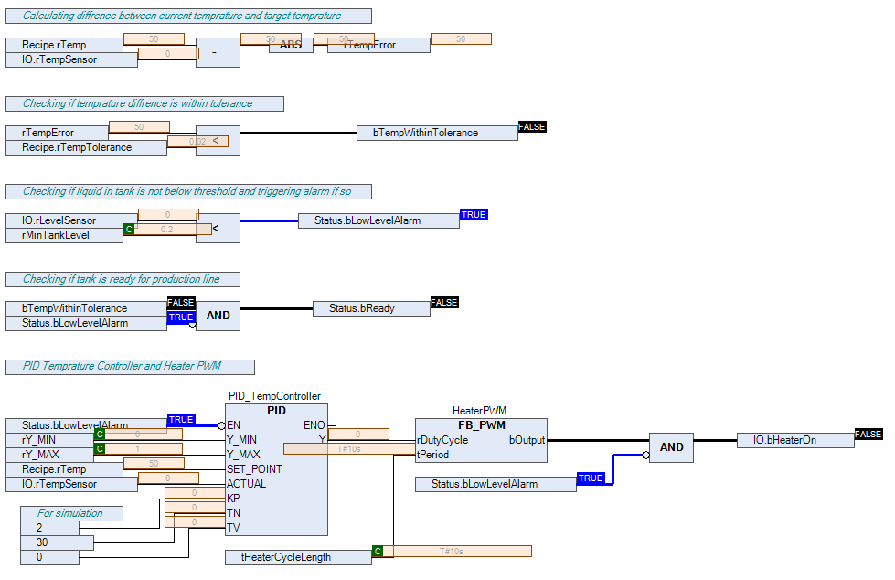
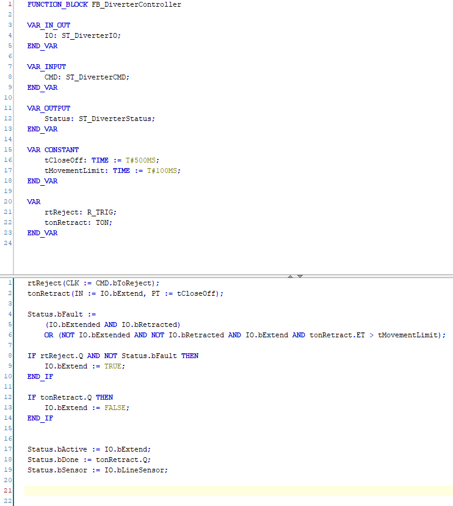
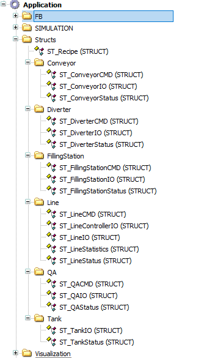

**Status:** In Development  
**Platform:** CODESYS V3.5 SP21  
**Programming:** SFC / CFC / ST  

# Production line for filling and sorting bottles

## Project Description
This project implements an industrial bottle filling and sorting line in CODESYS using the IEC 61131-3 standard.
The primary focus is designing modular production control using SFC and CFC architectures, combined with HMI development for operational control and monitoring. The application demonstrates practical industrial automation concepts including sequencing, QA-based sorting, alarm handling, PWM/PID control, and production process management.

## Current Development Status
This project is currently under active development.

### Current stage:
- Core production architecture designed
- Main subsystem controllers implemented
- Initial HMI framework created (basic controls and status visualization)
- Recipe and QA logic structure implemented

### Planned before final release:
- Complete subsystem integration
- Build simulation environment
- Verify process flow under multiple scenarios
- Expand HMI prototype
- Test alarm and fault logic

## System Features

### Conveyor Controller
- Start/Stop control based on production state
- Position sensor handling
- Jam detection and conveyor fault alarms

### Diverter Controller
- Bottle acceptance/rejection based on QA results
- Diverter piston timing and actuation
- Diverter fault and stuck-position monitoring

### Filling Station
- Recipe-based fill timing according to target volume and valve flow rate
- Filling conditional on tank readiness and production state

### Line Controller
- Coordinates all production stages
- Controls conveyor movement based on bottle position and process step
- Enables filling, QA, and sorting logic
- Tracks production statistics and operational data

### Tank Controller
- Monitors fluid level and temperature
- Controls heater using PID and PWM cycles
- Validates tank readiness according to recipe parameters

### Quality Assurance (QA)
- Verifies fill level using weight scale and level sensors
- Determines pass/fail result for sorting

### HMI Interface (Current Prototype)
- Basic operational controls
- Initial AUTO/MANUAL functionality
- Core production status display
- Foundational structure for expanded visualization

## Architecture

### Design Principles
- Modular controller-based architecture
- Separation of process logic by subsystem
- Centralized state-based production flow
- Recipe-driven process parameters
- Fault detection and alarm management
- Scalable structure for future expansion

### Implemented PLC Concepts
- IEC 61131-3 programming model
- Structured Text (ST)
- Continuous Function Chart (CFC)
- Sequential Function Chart (SFC)
- PID temperature control
- PWM cycle control
- Timer lifecycle management
- HMI / Visualization
- Alarm handling
- State-based process automation

## Software Structure
- PLC_PRG as central orchestration layer
- Modular FB-based subsystem controllers
- Dedicated STRUCT-based I/O, command, and status separation
- HMI and Simulation layers for testing and operator interaction

## Screenshots

### Main HMI Prototype

### Line Controller

### Tank Controller

### Diverter Controller

### Project Structure

---

## Purpose

This project was created as part of a professional PLC automation portfolio to demonstrate practical industrial programming architecture, modular control design, and real-world automation logic beyond basic academic examples.

---

## Tools

- CODESYS V3.5 SP21
- IEC 61131-3
- SFC / CFC / ST
- HMI Visualization

---

## Author

Paweł Mach

PLC / Automation Engineering Portfolio